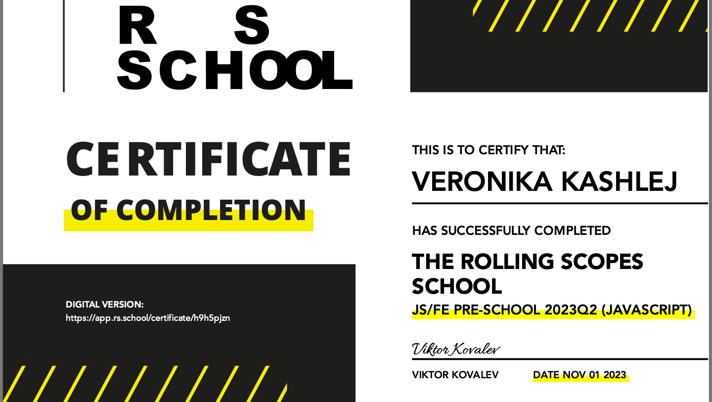

# **Veronika Kashlej**
# **My contacts info:** 
* Phone: +375 29 967-90-67
* E-mail: veronika.kashlei@mail.ru
* GitHub: [Veronika-Kashlej](https://github.com/Veronika-Kashlej/)
* Telegram: k_veroniiika
# **About me**
## I'm 17 years old, I'm studying at BSUIR, I want to work as a front-end developer, so I signed up for this course.
# My strengths:
* hardworking
* I can work in a team
* stress-resistant
* I don’t stop at achieved goals
# **Skills**
* HTML
* CSS 
* JavaScript 
* Git/GitHub
* Figma
# **Code Examples**
```
function getParallelepipedDiagonal(a, b, c) {
  return Math.sqrt((a ** 2) + (b ** 2) + (c ** 2));
}
```
# **Education**
* BSUIR (FCAD, EPOIT)
* JS/FE Pre-School 2023Q2

# **Languages**
* Russian - native speaker.
* Belorussian - native speaker.
* English - A2 (B1 in process…)

